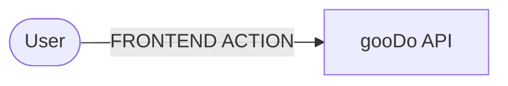

# BACKEND

<d style="background:var(--one)">-x-</d>
<d style="background:var(--two)">-x-</d>
<d style="background:var(--three)">-x-</d>
<d style="background:var(--four)">-x-</d>
<d style="background:var(--five)">-x-</d>
<d style="background:var(--six)">-x-</d>
<d style="background:var(--seven)">-x-</d>
<d style="background:var(--eight)">-x-</d>
<d style="background:var(--nine)">-x-</d>
<d style="background:var(--ten)">-x-</d>
<u>-x-</u>

##  Basic CDK structure

<d style="background:var(--one)">-x-</d>
Create RestApi  
<d style="background:var(--one)">-x-</d>
Create DynamoDB  
<d style="background:var(--one)">-x-</d>
Create Lambda with endpoints  
<d style="background:var(--one)">-x-</d>
String parameters  
<u>-x-</u>
Review how to link table to GraphQl  
<u>-x-</u>
JS DOCS

##  Security

<u>-x-</u>
Review Roles and Policies for API  
<u>-x-</u>
Review Roles and Policies for LAMBDA  
<u>-x-</u>
Review Roles and Policies for DB

##  Methods

<u>-x-</u>
**(POST)** Create task  
<u>-x-</u>
**(DELETE)** Delete task  
<u>-x-</u>
**(PUT)** Edit task  
<u>-x-</u>
**(PUT)** Mark task as done  
<u>-x-</u>
**(PUT)** Mark task as undone  
<u>-x-</u>
**(GET)** List tasks  
<u>-x-</u>
Errors management

##  Cognito system

<u>-x-</u>
Data encryptation  
<u>-x-</u>
Create user sesion  
<u>-x-</u>
Token management

##  Docker

<u>-x-</u>
Docker integration with lambdas

##  Test

<d style="background:var(--six)">-x-</d>
Jest structure  
<u>-x-</u>
Lambda testing  
<u>-x-</u>
Backend testing  
<u>-x-</u>
Frontend testing

##  Maintenance

<u>-x-</u>
Monthly pr updating package json  
<u>-x-</u>
No push if no test

##  Environments

<d style="background:var(--eight)">-x-</d>
Develope local and dev environments  
<u>-x-</u>
Deploy prod application  
<u>-x-</u>
Github prod branch  
<u>-x-</u>
Public prod and dev applications

##  Flowchart

